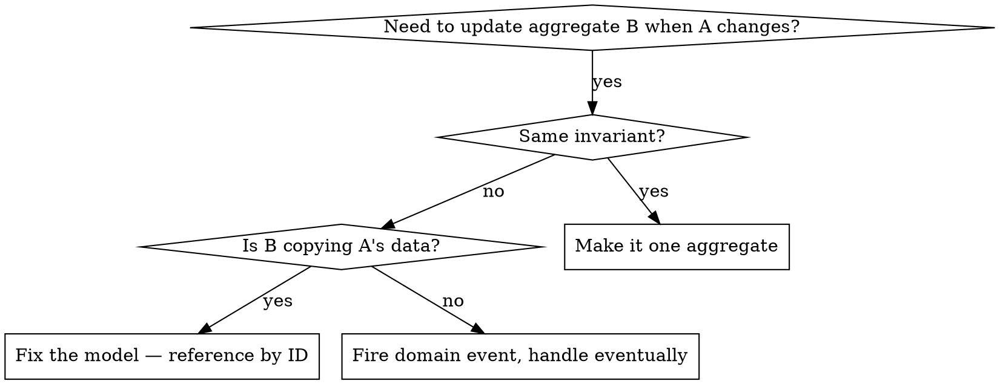
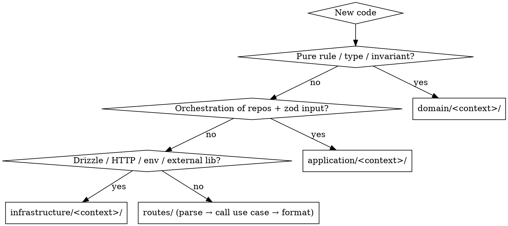

# DDD + Enterprise Expert (apex stack)

## Overview

`apps/api/` is layered on purpose: `domain/ → application/ → infrastructure/ → routes/`. Every feature has a home in those layers. **Reaching across them under time pressure is how this codebase rots.** This skill encodes the patterns already proven here so new code fits the codebase instead of inventing a parallel shortcut next to it.

**Core principle:** model the concept first, persist it second, expose it third. Schema is a *consequence* of the model, not a starting point.

**Violating the letter of these layers is violating the spirit.** "Just for now" is how route handlers become god-modules.

## When to use

- Adding endpoints or use cases under `apps/api/`
- Touching anything under `domain/`, `application/`, or `infrastructure/`
- Designing a new bounded context (a sibling of `games/`, `integrations/`, `import/`)
- Integrating an external system (IGDB, UploadThing, future providers)
- Anything multi-user where row ownership matters
- Cross-aggregate updates where a single transaction is tempting

**Skip when:** working only in `apps/client/`, fixing UI/CSS, or writing one-off scripts in `scripts/`.

## The four layers — what goes where

```
apps/api/src/
  domain/<context>/        ← pure types, business rules, Result<T,E>, no I/O
  application/<context>/   ← use cases: zod input + orchestrate domain + repos
  infrastructure/<context>/← Drizzle, HTTP clients, anti-corruption layers, env, auth
  routes/                  ← Hono handlers: parse → call use case → format response
```

| Layer | MAY import from | MUST NOT import |
|-------|-----------------|-----------------|
| `domain/` | other `domain/` only | Drizzle, Hono, env, fetch, fs, crypto-keys |
| `application/` | `domain/`, `zod` | Hono, Drizzle directly (use repo interfaces) |
| `infrastructure/` | `domain/` interfaces, libs | `application/`, `routes/` |
| `routes/` | `application/` via `wiring.ts`, `_problem-json` | `domain/` directly, `infrastructure/db` directly |

**Routes never touch `db`.** Ever. If you typed `import { db }` inside a route, you took a shortcut that creates an isomer of every existing use case. Stop, write the use case, wire it in `wiring.ts`.

## Aggregate pattern — `Game` is the reference

`domain/games/game.ts` is the canonical aggregate. Copy its shape:

- **Private constructor.** Forces construction through smart constructors.
- **`static fromPersistence(row)`** — builds from a trusted DB row (may throw on structural corruption like a NULL `externalId`).
- **`static create(props): Result<T, ValidationError>`** — validates untrusted input. Lives on `NewGame`, not on `Game` itself, because *creation* and *lifetime mutation* are different commands. See `new-game.ts`.
- **Mutation methods return a new instance (`Result<Game, …>`) or a `Command` object** (see `moveToCollection()` returning a `GameUpdate`). Never mutate fields in place.
- **`throw` for programmer errors, `err()` for domain validation.** `moveToCollection()` throws when called on an already-owned game (impossible state). `applyMetadata()` returns `err()` for a malformed cover URL (untrusted input).

```ts
// good — invariants enforced by type
const result = NewGame.create({ kind: 'wishlist', userId, title, ... });
if (!result.ok) return err({ kind: 'domain', error: result.error });
const game = await this.repo.create(result.value);

// bad — anemic, invariants live in the route or the DB
await db.insert(games).values({ kind: 'wishlist', title, ... });
```

## Value objects — `ReleaseYear`, `HoursPlayed`, `ExternalMetadataRef`

If a primitive has rules, wrap it. Two factories:

```ts
export class ReleaseYear {
  private constructor(public readonly value: number) {}
  static create(n: unknown): Result<ReleaseYear, GameValidationError> { /* validate */ }
  static fromTrusted(n: number): ReleaseYear { return new ReleaseYear(n); }
}
```

`create` for untrusted input → `Result`. `fromTrusted` for DB rows where the invariant was enforced at write time. Constructor stays private.

## Repository pattern

- **Interface in `domain/<ctx>/<thing>-repository.ts`.** No Drizzle types leak through.
- **Drizzle impl in `infrastructure/<ctx>/drizzle-<thing>-repository.ts`.**
- **`withTx(tx: unknown): Repo`** for transactional binding — the `unknown` is intentional, keeps the domain pure.
- **Every method on a per-user entity takes `userId`** as a separate argument and includes it in the `WHERE`. This is a security boundary, not a convenience.
- **Optimistic locking via `expectedUpdatedAt`.** Mutating methods take the timestamp the caller read and throw `OptimisticLockError` on a stale write. Routes map it to 409 problem+json via `optimisticLockProblem`.

## Application service shape

```ts
export class CreateGame {
  constructor(
    private readonly repo: GameRepository,
    private readonly platformRepo: PlatformRepository,
  ) {}
  async execute(input: unknown, userId: string): Promise<Result<Game, CreateGameError>> {
    // 1. zod parse `input`
    // 2. cross-aggregate lookups (e.g. platform exists)
    // 3. domain smart constructor / aggregate method
    // 4. repo write (optionally inside repo.withTx)
    // 5. return ok(...) or err(...)
  }
}
```

- **Zod schemas live in the application layer.** Not routes (routes just parse `await c.req.json()`). Not domain (domain doesn't know about wire formats).
- **The error union is exported and discriminated** so routes can map exhaustively to problem+json.
- **One class per use case.** No `GameService` god class.

## Bounded contexts and cross-aggregate work

Each folder under `domain/` is a bounded context: `games/`, `platforms/`, `integrations/`, `dictionary/`, `import/`, `developers/`, `genres/`. Contexts communicate through **explicit application-layer orchestration**, not by reaching into another context's tables.

**Hard rule on cross-aggregate writes:** do **not** update two aggregates in the same DB transaction unless they share a true invariant (and then question whether they should be one aggregate). Prefer, in order:

1. **Reference by identity, not by copy.** If `Game.platform` is a string copy of `Platform.name`, "rename platform" is a smell — model `Game` to hold `platformId` and read the name on hydrate. The original problem disappears.
2. **Domain event + handler.** Aggregate A writes, fires an event, a handler reads it and performs the command on B. Accept temporary inconsistency.
3. **Eventual consistency via a scheduled job** (see `infrastructure/cron/`) for backfills and cleanups.



## Anti-corruption layer — IGDB is the example

External systems do not bleed into the domain.

- **Port** — `domain/games/game-metadata-provider.ts`. Speaks in domain terms (`fetchMetadata(externalId): Snapshot`).
- **Adapter** — `infrastructure/igdb/igdb-game-metadata-provider.ts`. Speaks IGDB and translates.
- **The domain never imports anything from `infrastructure/igdb/`.**

When you add a new provider (Steam, RAWG, …), copy this split. The domain port stays unchanged; you write a new adapter and wire it.

## Multi-tenant / IDOR — non-negotiable

**Every per-user repository method takes `userId` and includes it in the `WHERE`.** The frontend filtering IDs is not a security model.

```ts
// good
.where(and(eq(games.userId, userId), eq(games.externalId, externalId)))

// bad — IDOR
.where(eq(games.externalId, externalId))
```

There is `games.idor.test.ts` and a `security.idor_attempt` log event. If you find yourself omitting the `userId` filter "because the frontend already filters", that rule is firing — don't.

## Transactions, idempotency, errors, config, logging

- **Transactions:** open in the application layer with `db.transaction(tx => repo.withTx(tx).…)`. Routes never call `db.transaction`.
- **Idempotency:** every mutating endpoint gets `idempotencyKeyMiddleware`. New mutating endpoint? Add it. Don't ask.
- **Errors:**
  - Domain validation → `Result<T, DomainError>` (discriminated union).
  - Impossible / programmer error → `throw`.
  - HTTP response → `_problem-json` helpers (`domainProblem`, `optimisticLockProblem`, `payloadTooLargeProblem`, `zodIssuesToProblemJson`, `internalProblem`). **Never** `return c.json({ error: '...' }, 400)` ad-hoc.
- **Config:** validate at module load and throw (see `validateAuthConfig`). Fail-fast > fail-mid-request.
- **Logging:** use the request-scoped logger `c.get('logger')`. It already carries `requestId` + `userId`. Don't import a global logger.

## Where does this code go? — decision flow



## Rationalization table

| Excuse heard from PM / future-you | Reality |
|---|---|
| "Just patch the route, it's tiny" | Tiny features become the template the next dev copies. Write the use case. |
| "We'll refactor later" | The codebase is the artifact of every "later". There is no later. |
| "Frontend already filters by user" | The frontend is not part of your auth boundary. Filter on the server, every time. |
| "One UPDATE join is simpler" | Touching two aggregates in one SQL statement bakes a cross-context coupling into the schema. Use an event or rethink the model. |
| "I'll skip the value object and use a number" | Then every caller revalidates, and one of them forgets. VO once, trust everywhere. |
| "Add the column, then the feature works" | Schema-first inverts the dependency. Model the concept first; schema falls out of it. |
| "I'll throw a generic Error here" | Use `Result` for validation, `throw` for impossible states, problem+json for HTTP. Three different things. |
| "Reaching into `db` from a route is fine just this once" | Once becomes a pattern. The Repository interface exists so the route never needs to. |
| "We don't need optimistic locking on this one" | Until two clients overwrite each other. The cost of `expectedUpdatedAt` is one parameter. |
| "It's the user's own data, IDOR doesn't apply" | IDOR applies the moment your URL takes an ID. Always filter by `userId`. |
| "The PM said skip the use-case layer" | Non-engineers cannot authorize an architectural shortcut. Push back; build it right. |
| "I'll wrap it in a transaction to keep it consistent" | Transactions across aggregates couple them forever. Use events for cross-aggregate effects. |

## Red flags — STOP and reconsider

- `import { db }` inside `routes/` or `domain/`
- A route handler longer than ~30 lines (other than mechanical mapping)
- A Drizzle table or column referenced inside `domain/`
- A new aggregate without `static fromPersistence`
- Mutating an aggregate in place (`game.title = '…'`)
- Adding a DB column before naming the domain concept it represents
- Writing two aggregates in the same `db.transaction` without an explicit shared-invariant note
- A mutating endpoint without `idempotencyKeyMiddleware`
- A per-user repository method without a `userId` parameter
- `c.json({ error: '...' })` instead of a `_problem-json` helper
- Domain code that imports from `infrastructure/`
- A new external integration whose types appear outside `infrastructure/<provider>/`

Any of these mean: undo, model the concept, place it in the right layer, redo.

## Quick reference

| Need | Where it goes | Pattern |
|---|---|---|
| New aggregate | `domain/<ctx>/<thing>.ts` | private ctor, `fromPersistence`, mutations return new instance or Command |
| Aggregate creation | `domain/<ctx>/new-<thing>.ts` | `static create(props): Result` |
| Value object | `domain/<ctx>/<thing>-value-objects.ts` | `create` → Result, `fromTrusted` → instance |
| New use case | `application/<ctx>/<verb>-<thing>.ts` | class, `execute(input, userId): Promise<Result<…>>` |
| Repo interface | `domain/<ctx>/<thing>-repository.ts` | `withTx`, methods take `userId`, optimistic `expectedUpdatedAt` |
| Repo impl | `infrastructure/<ctx>/drizzle-<thing>-repository.ts` | Drizzle only here |
| External provider | port in `domain/<ctx>/`, adapter in `infrastructure/<provider>/` | ACL pattern |
| New endpoint | `routes/<area>.ts` | wire from `wiring.ts`, format via `_problem-json` |
| Cross-aggregate effect | domain event + handler, or eventual consistency | not one transaction |
| Mutating endpoint | always wear `idempotencyKeyMiddleware` | no exceptions |
| Config / secrets | `infrastructure/config/`, validated at module load | fail-fast |
